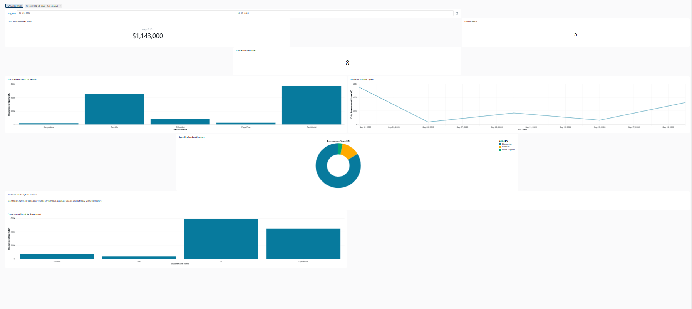

# Procurement Analytics Dashboard | Databricks

## Project Overview

An end-to-end procurement analytics project built using Databricks Free Edition, SQL, and PySpark. The project transforms purchase order data into an analytics-ready star schema and an interactive dashboard for monitoring procurement spend.

## Business Objectives

* Monitor total procurement spend.
* Track purchase orders and vendors.
* Analyze spending by vendor, product category, and department.
* Examine procurement spend over time using a date filter.

## Technology Stack

* Databricks Free Edition
* Databricks SQL
* PySpark
* Delta tables
* Star schema dimensional modeling
* SQL dashboards

## Data Architecture

The project follows a Bronze–Silver–Gold workflow:

1. **Bronze:** Stores the initial purchase order data in a Delta table.
2. **Silver:** Filters invalid records, including missing required fields and non-positive quantities or prices.
3. **Gold:** Produces aggregated datasets for vendor, product category, and department analysis.

## Data Warehouse Schema

The star schema includes:

**Fact table**

* `fact_purchase_orders`

**Dimension tables**

* `dim_date`
* `dim_vendor`
* `dim_product`
* `dim_department`

The fact table stores purchase order line items, including quantity, unit price, and total amount.

## Dashboard Features

* Total Procurement Spend
* Total Purchase Orders
* Total Vendors
* Procurement Spend by Vendor
* Daily Procurement Spend
* Spend by Product Category
* Procurement Spend by Department
* Global date filter

## Data Quality Checks

* Checked for missing required fields.
* Filtered non-positive quantities and unit prices.
* Validated fact-table dimension key matches.
* Verified row counts across the Bronze, Silver, and Gold layers.

## Dashboard Access

The dashboard is published in Databricks. Access depends on the permissions configured in the Databricks workspace.

Dashboard link:https://dbc-bcc5a84d-43ce.cloud.databricks.com/dashboardsv3/01f1bf17ed9b172ab8f89454e1af0091/published?o=7474648872892756.

## Project Resources

* [Data Warehouse Architecture](docs/data-warehouse-architecture.md)
* [Architecture Diagram](docs/architecture-diagram.md)
* [SQL Analysis Queries](sql/procurement_analysis.sql)

## Dashboard Preview

[Open the published Databricks dashboard](https://dbc-bcc5a84d-43ce.cloud.databricks.com/dashboardsv3/01f1bf17ed9b172ab8f89454e1af0091/published?o=7474648872892756)

> **Note:** The dashboard link requires appropriate Databricks workspace access. The screenshot and project documentation can be viewed directly on GitHub.

## Key Skills Demonstrated

* SQL querying and aggregation
* PySpark data transformation
* Bronze–Silver–Gold data processing
* Star schema data modeling
* Data quality validation
* Dashboard design and KPI reporting

## Project Status

Completed initial data warehouse development and dashboard creation. Further improvements could include automated ingestion, scheduled refreshes, and additional procurement KPIs.
