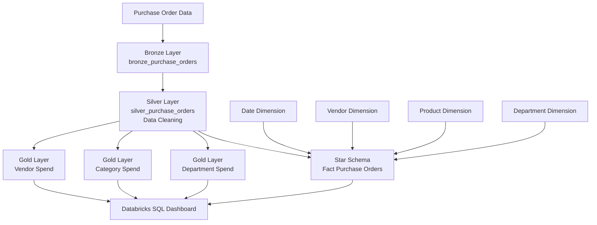

# Procurement Analytics Architecture

```mermaid
flowchart TD
    A["Purchase Order Data"] --> B["Bronze Layer<br/>bronze_purchase_orders"]
    B --> C["Silver Layer<br/>silver_purchase_orders<br/>Data Cleaning"]
    C --> D["Gold Layer<br/>Vendor Spend"]
    C --> E["Gold Layer<br/>Category Spend"]
    C --> F["Gold Layer<br/>Department Spend"]

    C --> G["Star Schema<br/>Fact Purchase Orders"]
    H["Date Dimension"] --> G
    I["Vendor Dimension"] --> G
    J["Product Dimension"] --> G
    K["Department Dimension"] --> G

    D --> L["Databricks SQL Dashboard"]
    E --> L
    F --> L
    G --> L
```
